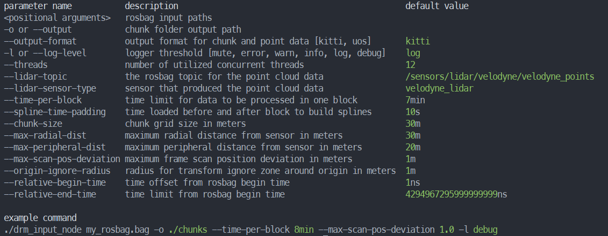

# Parameter und Programmanpassung

**Wichtig: Sollten Sie einen Fehler bekommen, weil ihr RAM überfüllt ist, siehe Abschnitt [Anpassung an das eigene System](#Anpassung)**

## Liste aller Parameter
- [--help](#Help)
-  [Positional Arguments](#Ein-Ausgabe)
-  [--output oder -o](#Ein-Ausgabe)
- [--output-format](#Ein-Ausgabe)
-  [--lidar-topic](#Topic)
-  [--lidar-sensor-type](#Topic)
-  [--relative-begin](#Zeitabschnitte)
-  [--relative-end](#Zeitabschnitte)
-  [--spline-time-padding](#Splines)
-  [--chunk-size](#chunksize)
-  [--max-radial-dist](#Distanz)
-  [--max-peripheral-dist](#Distanz)
-  [--max-scan-pos-deviation](#Abweichungen)
-  [--origin-ignore-radius](#Transformation)
-  [--time-per-block](#Anpassung)
-  [--threads](#Anpassung)
- [--logger-level oder -l](#Logger)

## Hilfeoption
Über die Eingabe `--help` als Parameter wird eine Liste aller Parameter mit einer kurzen Beschreibung und, falls vorhanden, Default Wert des Parameters ausgegeben. Zusätzlich wird eine kurze Beispiel Eingabe angegeben. Das Programm wir daraufhin beendet.

## Datenspeicherorte zum Einlesen von Rosbags, Ausgeben der Ergebnisse
Die Datenspeicherorte der Rosbags werden als Input Path in das Programm eingegeben. Diese werden als Positional Arguments, also ohne Flagge, übergeben.
Das Programm bricht mit der Fehlermeldung `"No rosbag paths provided."` ab, wenn der Input Path fehlt.
Der Ort, an dem die verarbeiteten Daten gespeichert werden sollen, wird als Output Path eingegeben. Dieser ist nach der Flag `-o` oder `--output` anzugeben.
Der Output Path darf auf eine schon existierende Speicherstelle verweisen, sofern die dort gespeicherten Chunks die gleiche Größe ([Chunk-size](#chunksize)) haben. Sollte die Chunkgröße eine andere sein, darf der Output Path nicht auf diesen Ortner zeigen. 
Das Datenformat in der die verarbeiteten Daten ausgegeben werden, kann über die Flag `--output-format`angegeben werden. Wählbare Formate sind das KITTY Format mit dem Argument `kitty` und das Point Cloud Format mit dem Argument `uos`.
Das Programm bricht mit der Fehlermeldung `"No output path provided."` ab, wenn der Output Path fehlt.

## Angabe des Lidar-Topics und Art des  Lidar-Sensors
Der Pfad zu dem Lidar Topic in dem die point cloud Daten liegen wird über die Flag `--lidar-topic` angegeben. Der Default Pfad für diesen ist `/sensors/lidar/velodyne/velodyne_points`.
Die Art des Sensors über die die Daten Aufgenommen wurden wird über die Flag `--lidar-sensor-type` übergeben. Der default Typ des Lidar Sensors ist `velodyne_lidar`.

## Zeitabschnitte innerhalb der Rosbags auswählen
Wenn innerhalb der angegebenen Rosbags nur ein bestimmter Zeitabschnitt verarbeitet werden soll, dann lässt sich der Beginnzeitpunkt aller Rosbags über die Flag `--relative-begin`und der Endzeitpunkt über `--relative-end` festlegen. 
Die Zeitpunkte lassen sich als Zeit Literale angeben, also als Wert mit den Suffix *h* für Stunde, *min* für Minute, *s* für Sekunde, *ms* für Millisekunde, *ns* für Nanosekunde und *us* für Mikrosekunde. 
Ein Beispiel wäre `--relative-begin 5min` für einen Startzeitpunkt bei 5 Minuten in allen angegebenen Rosbags.
Der Default Wert für den Startzeitpunkt ist der Minimale Zeit Wert von Ros, nähmlich 1ns.
Der Default Wert für den Endzeitpunkt ist der Maximale Zeit Wert von Ros, nähmlich 4294967295999999999ns.

## Splines bilden 
Um Splines zu bilden werden Daten innerhalb eines festgelegten Zeitabschnitts vor und nach den Blöcken mit geladen werden.
Diese ist mit `--spline-time-padding` als Zeit Literal wie bei [Zeitabschnitte innerhalb eines Rosbags](#Zeitabschnitte) anzugeben und der Default Wert liegt bei 10s.

## Größe der Abschnitte, in die die Karte aufgeteilt wird
Die Karte wird in Abschnitte geteilt, dessen physische Größe bei Programmstart als sogenannte Chunk Größe festgelegt werden kann. Diese wird mit dem Flag `--chunk-size`in Metern übergeben. Der Default Wert liegt bei 30m, wodurch die Chunks eine Größe von 30x30m haben.

## Distanz von Punkten angeben
Die maximale radiale und periphere Distanz können mit den Flags `--max-radial-dist` und `--max-peripheral-dist` in Metern angegeben.
Der Defaultwert für die maximale radiale Distanz liegt bei 50 Metern und der Defaultwert für die periphere Distanz liegt bei 20 Metern.

## Verhalten bei großen Scan-Abweichungen
Die maximal erlaubte Abweichung von Scan Positionen wird mit der Flag `--max-scan-pos-deviation` übergeben.
Der Defaultwert der erlaubten Abweichung von Scan Positionen liegt bei 1 Meter.

## Radius in dem Transformationen ignoriert werden
Der Radius um dem Sensor in dem die übergebenen Transformationen ignoriert werden kann über die Flag `--origin-ignore-radius` in Metern gesetzt werden.
Der Default Radius in dem die Transformationen ignoriert werden liegt bei 1m.

## Anpassung an das eigene System
#### Blockgröße
Damit das Program eine möglichst optimale RAM-Auslastung erreicht, kann man die auf einmal zu verarbeitende Blockgröße  für den Rechner, auf dem das Programm läuft, spezifisch angeben.
Bei einer zu großen Blockgröße stürzt das Programm wegen einer RAM-Überlastung ab und bei einer zu kleinen Blockgröße wird das Programm ineffektiv, da die RAM-Auslastung zu gering ist.
Die Blockgröße wird als Zeitblock, also wie viel Zeit einem Zeitabschnitt, der auf einmal verarbeitet wird, ist. Dieser wird mit der Flag `--time-per-block` als Zeit Literal wie bei [Zeitabschnitte innerhalb eines Rosbags](#Zeitabschnitte) angegeben.
Der Defaultwert der Blockgröße liegt bei 10min.
#### Threadanzahl
Wie schnell einzelne Blöcke abgearbeitet werden kann durch die Anzahl der verwendeten Threads beeinflusst werden, wobei die Anzahl an Threads die zur verfügung stehen vom System auf dem das Programm läuft abhängen.
Die zu verwendete Threadanzahl ist durch das Flag `--threads` anzugeben. 
Der Defaultwert der Threadanzahl liegt bei 12.

Beide Parameter sollten für einen möglichst effizienten Programmablauf gesetzt werden, auch wenn das Programm auch ohne Setzung der Parameter läuft.

## Menge der Informationen, die von dem Logger ausgegeben werden
Abhängig der Nutzung des Programms ist die Menge der Informationen die der Logger ausgibt relevant und kann über feste Level angepasst werden.
Das Level des Loggers wird über die Flags `-l`und `--logger-level`übergeben, wobei die möglichen level `mute`,`error`, `warn`, `info`, `log`und `debug`sind.
Das Default Level des Loggers ist `log`.