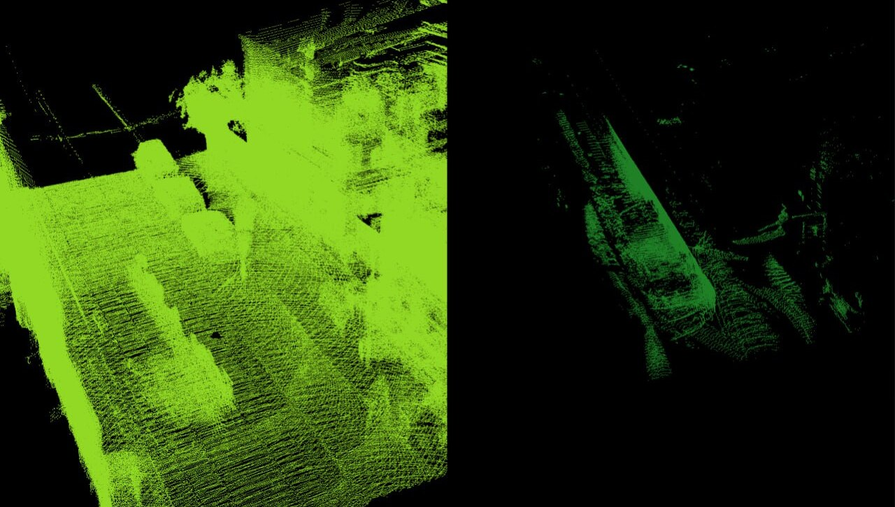
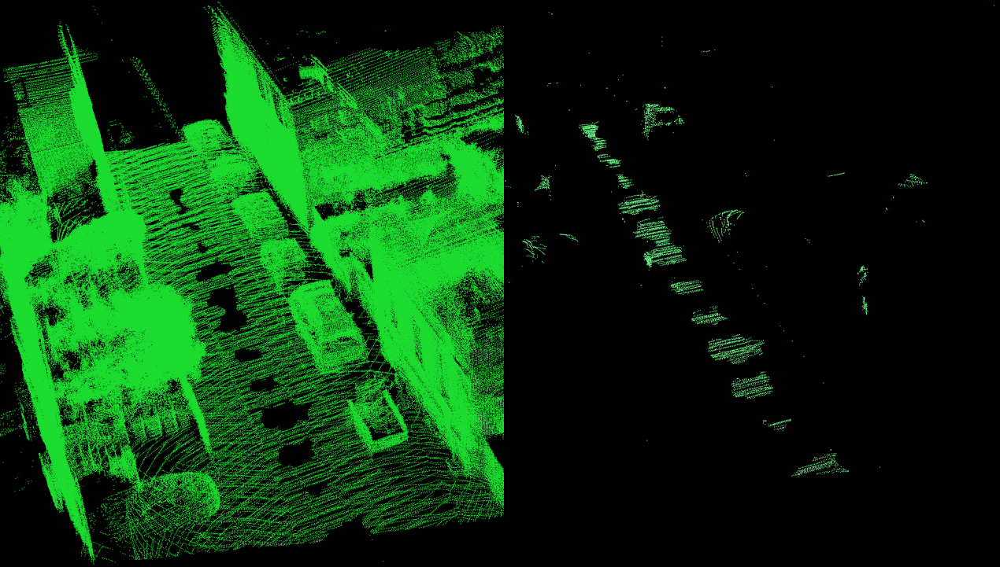

# Removert Overview

Das zweite Projekt, das für die Entfernung der dynamischen Objekten genutzt wurde, ist [Removert](https://github.com/gisbi-kim/removert/tree/master), ein Projekt des KIT.

Removert ist darauf spezialisiert, statische Karten in natürlichen Umgebungen zu erstellen. Es bietet ein Werkzeug zum Entfernen dynamischer Punkte durch die Konstruktion solcher statischen Karten.

Beim Testen vom Algorithmus wurden Parameter in der Datei [params_kitti.yaml](https://github.com/gisbi-kim/removert/blob/726f48b36b27eae9a84c75f07b953f8c791caf9b/config/params_kitti.yaml) angepasst, darunter die Voxelgröße für die Dichteanpassung und die statische Empfindlichkeit:
```
# @ Removert params 
  # about density 
  downsample_voxel_size: 0.05 # user parameter but recommend to use 0.05 to make sure an enough density (this value is related to the removing resolution's expected performance)

  # about Static sensitivity (you need to tune these below two values, depends on the environement)
  # - if you use a raw scan 
  num_nn_points_within: 2 # how many - using higher, more strict static 
  dist_nn_points_within: 0.1 # meter - using smaller, more strict static
```
Es wurden mehrere unterschiedliche Kombinationen von Parametern in verschiedenen Werteverhältnissen verwendet. Zum Beispiel  ```(downsample_voxel_size: 0.07, num_nn_points_within: 3,  dist_nn_points_within: 0.05)``` oder  ```(downsample_voxel_size: 0.04, num_nn_points_within: 5,  dist_nn_points_within: 0.007)```.
Diese Anpassungen wurden vorgenommen, um die Leistung des Programms in unterschiedlichen Umgebungen zu optimieren. Allerdings, hat removert sowohl mit originellen Werten als auch mit angepassten, keine befriedigende Ergebnisse auf den meisten Chunks geliefert. Das Ergebnis sieht man deutlicher auf den Bildern. Die rechte Seite enthält die erkannten dynamischen Objekte im Chunk, während die linke Seite die statische Karte repräsentiert, welche die dynamischen Objekte entfernt hat:




