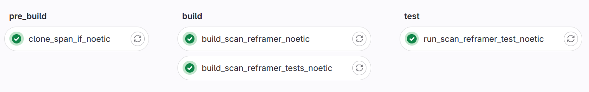

# CI/CD-Pipeline

  Die CI/CD-Pipline hilft bei der Weiterentwicklung der Dynamic Rail Map, indem sie immer wenn neuer Code gepushed wird das Programm und die Tests einmal Compiled und auf dem Testdatensatz ausführt. Dabei wird ein Docker Image genutzt, welches das Zeilsystem repräsentiert. Dies sorgt dafür, dass eventuelle Fehler schneller entdeckt werden können.

#### Dafür hat die CI-Pipline 3 Piplinestufen:
- pre_build: Sorgt dafür das alle benötigten Libraries zur Verfügung stehen
- build: Kompiliert das Programm und die Tests
- test: Führt die Tests aus und lässt das Programm einmal über den Testdaten

//TODO: namen im Screenshot noch veraltet

### Genaue Informationen zu den Jobs:
##### clone_libs_if_noetic 
- Piplinestufe: pre_build
- Dockerimage: tou7/ros:noetic
- **Beschreibung: Läd benötigte Libaries herrunter, falls diese nicht vorhanden sind.**
##### build_scan_reframer_noetic
- Piplinestufe: build
- Dockerimage: tou7/ros:noetic
- **Beschreibung: Kompiliert den Reframer, wie er zum ausführen Verwendet wird. Ist Erfolgreich, wenn die Kompilierung fehlerfrei abgeschlossen wird.**
##### build_scan_reframer_test_noetic 
- Piplinestufe: build
- Dockerimage: tou7/ros:noetic
- **Beschreibung: Kompiliert die Tests für den Reframer. Ist Erfolgreich, wenn die Kompilierung fehlerfrei abgeschlossen wird.**
##### run_scan_reframer_test_noetic 
- Piplinestufe: test
- Dockerimage: tou7/ros:noetic
- **Beschreibung: Führt die Tests für den Reframer aus. Nutzt den build von "build_scan_reframer_test_noetic". Ist Erfolgreich, wenn alle Tests fehlerfrei durchlaufen.**

Anmerkung: Das "noetic" in den Jobnamen steht für die ROS-Version, da die Möglichkeit besteht, dass das Programm in Zukunft unter unterschiedlichen ROS-Versionen laufen soll und dann auch auf all diesen getestet werden muss.
