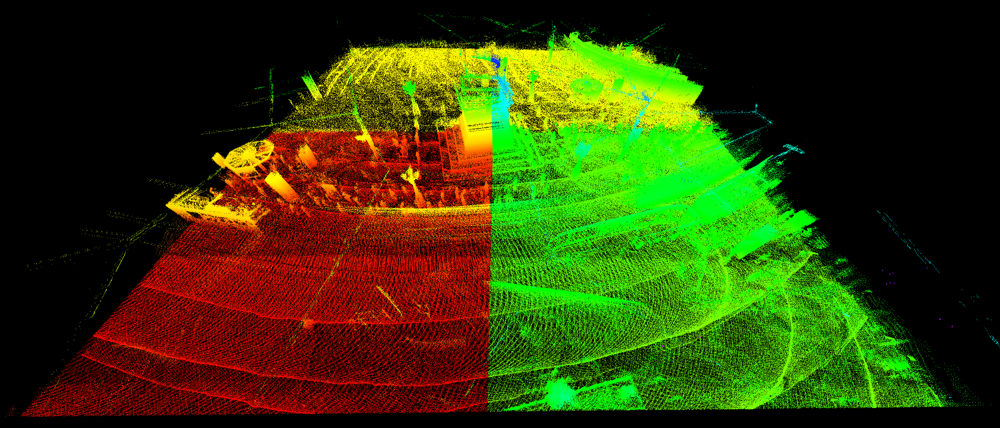

# Reframer Overview

Um in den bereitgestellten Daten Verkehrsteilnehmer erkennen zu können, benötigt das Fahrassistenzsystem ein Abbild der statischen Umgebung als Ground Truth. Ground Truth bezeichnet dabei die zuverlässige Darstellung der statischen Umgebung, die als Referenz für die Objekterkennung dient.

Das sogenannte "Reframer" soll nun diese Ground Truth als eine punktbasierte 3D-Karte der Umgebung des Darmstädter Schienennetzes aus den LiDAR-Daten der InnoTram erstellen. Hier werden die LiDAR-Daten mehrerer Fahrten angepasst und kombiniert, um eine kontinuierliche Karte zu erhalten.

**Input**: Rosbags der InnoTram

**Output**: [KITTI-Chunks mit entsprechenden Metadaten](reframer/chunk_format)

Beispiel: Die punktbasierte 3D-Karte, die vom "Reframer" erstellt wurde, umfasst den Luisenplatz und ist in 4 Chunks unterteilt