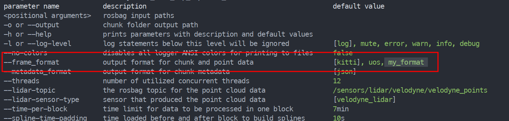
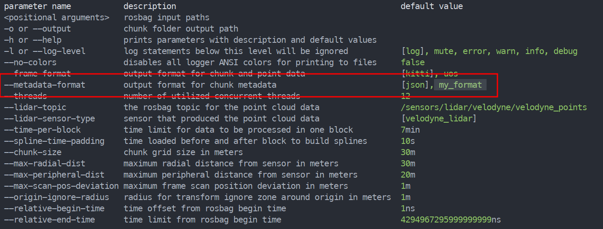

Um einfaches Hinzufügen neuer Schnittstellen zu gewährleisten, sind Teile des Reframers in sogenannten Modulen implementiert.
Ein Modul besteht aus einer C++ Klasse, die ein gegebenes Interface implementiert.
Hierbei bestehen Interfaces für drei Modul Klassen:
 - `point_cloud_parsing` bietet ein Interface für das Parsen von Sensor spezifischen LiDAR Daten
 - `frame_exportation` Module sind für das Exportieren von Punktdaten sowie Aufnahmetransformationen zuständig
 - `metadata_transcoders` lesen und speichern Chunk spezifische Metadaten

Das Hinzufügen eines Moduls läuft ab wie folgt
- Header für Klasse in `include/modules/<INTERFACE>/my_class.hpp` erstellen
- Klasse in `source/modules/<INTERFACE>/my_class.cpp` *mit statischen Funktionen* implementieren
- Klasse in `source/module_registration/<INTERFACE>_registration.ipp` registrieren
Nach dem befolgen dieser Schritte sollte das neue Modul als Option im Help Command angezeigt werden und sich mit dem entsprechenden Command auswählen lassen.

Die konkrete Umsetzung der Schritte wird im folgenden für jedes Interface genau erklärt.

## Hinzufügen neuer Parser für LiDAR Sensoren

Falls ein neuer LiDAR Sensor in Betrieb genommen wird, der die Punktdaten in einem Format als der bestehende Velodyne LiDAR speichert, muss ein neues `point_cloud_parsing` Modul für das Lesen der Daten hinzugefügt werden.

Der erste Schritt besteht darin, den Header für die neue Klasse zu erstellen:

> `my_lidar` und `MY_LIDAR` muss mit dem Namen des neuen Sensors in lowercase bzw. uppercase snake_case ersetzt werden.

 ***include/modules/point_cloud_parsing/my_lidar.hpp***
```c++
#pragma once

#include "config/types.hpp"
#include <rosbag/view.h>
#include <system_error>
#include <string_view>

namespace drm::point_cloud_parsers {

struct my_lidar {

// This name is used for selecting the parser via cli.
static constexpr std::string_view sensor_name = "my_lidar";

/*
* @tparam P The type of the given point predicate.
* @param lidar_frames_view The rosbag view containing the sensor data.
* @param timed_points The output vector of timed points to be written to.
* @param predicate The predicate to filter the lidar points.
*
* @return An @c std::error_code indicating the status of the operation.
*/
template<typename P>
[[nodiscard]] inline static std::error_code parse(
	rosbag::View& lidar_frames_view,
	std::vector<types::timed_point_t>& timed_points,
	const P& predicate
) noexcept;

private:
	// helper functions etc.
};

} // namespace drm::point_cloud_parsers

#define INCLUDE_MY_LIDAR_IMPLEMENTATION
#include "modules/point_cloud_parsers/my_lidar.ipp"
#undef INCLUDE_MY_LIDAR_IMPLEMENTATION
```

Im nächsten Schritt muss die `parse` Funktion implementiert werden.
Die Aufgabe dieser Funktion besteht darin, aus der View des Rosbag LiDAR Topics, die Punktdaten mit Timing Information zu lesen, mit dem `predicate` zu filtern und letztlich in die `timed_points` List zu schreiben.

***source/modules/point_cloud_parsers/my_lidar.ipp***
```c++
#ifndef INCLUDE_MY_LIDAR_IMPLEMENTATION
# error Never include this file directly include 'my_lidar.hpp'
#endif

namespace drm::point_cloud_parsers {

template<typename P>
std::error_code my_lidar::parse(
	rosbag::View& lidar_frames_view,
	std::vector<types::timed_point_t>& timed_points,
	const P& predicate
) noexcept {
	// implementation...
	return {};
}

} // namespace drm::point_cloud_parsers

```

> Wir empfehlen die Referenz Implementation für den bestehenden Velodyne LiDAR in `source/modules/point_cloud_parsers/velodyne_lidar.ipp` zuerst durchzulesen und zu verstehen.

> Falls der Sensor auch das `PointCloud2` Format nutzt bietet sich der `helpers/ros_point_field_helpers.hpp` Header an, um das Format der Nachrichten zu überprüfen und Daten auszulesen.

Im letzten Schritt muss der neue Parser registriert werden, damit das restliche System diesen auch verwenden kann.
Dafür muss lediglich in der Registration Datei des Interfaces der Header included und eine Instanz der Klasse zu dem `parsers` Tupel hinzugefügt werden:

***source/module_registration/point_cloud_parser_registration.ipp***
```c++
#include "modules/point_cloud_parsers/velodyne_lidar.hpp"
#include "modules/point_cloud_parsers/my_lidar.hpp"

namespace drm::point_cloud_parsing {

inline constexpr auto parsers = std::make_tuple(
	drm::point_cloud_parsers::velodyne_lidar{},
	drm::point_cloud_parsers::my_lidar{}
);
  
} // namespace drm::point_cloud_parsing
```

Der `--help` Command sollte nun den neuen Sensor Typen unter `--lidar-sensor-type` auflisten:

Das Auswählen des neuen Sensors sowie des zugehörigen rosbag topic wird hier beschrieben #TODO 


## Hinzufügen neuer Frame Datenformate

Falls eine neues Frame Format (z.B.: als Schnittstelle zu einem neuen Programm) hinzugefügt werden soll, erfolgt dies über ein neues `frame_exportation` Modul.

Der erste Schritt besteht wieder darin, den Header für die neue Klasse zu erstellen:

> `my_format` muss mit dem Namen des neuen Formats in lowercase snake_case ersetzt werden.

***include/modules/frame_exporters/my_format.hpp***
```c++
#pragma once

#include "config/types.hpp"
#include <system_error>
#include <string_view>
#include <filesystem>
#include <system_error>
#include <mutex>
#include <cinttypes>


namespace drm::frame_exporters {

struct my_format {

static constexpr std::string_view format_name = "my_format";

[[nodiscard]] static std::error_code write(
	const std::filesystem::path& chunk_directory,
	std::mutex& chunk_lock,
	std::size_t frame_index,
	const drm::types::transform_t& pose,
	tcb::span<const types::translation_t> points
) noexcept;

private:
	// helper functions etc.
};

} // namespace drm::frame_exporters
```

Im nächsten Schritt muss die `write` Funktion implementiert werden.
Die Aufgabe dieser Funktion besteht darin, die Punkt Daten und Aufnahmetransformation des Frames mit index `frame_index` in eine oder mehrere Dateien im Chunk Ordner zu schreiben.

> Eine wichtige Rolle spielt hierbei der `chunk_lock` Mutex. Dieser wird gesperrt an die `write` Funktion übergeben und muss von dieser entsperrt werden. Während `chunk_lock` gesperrt ist, darf kein anderer Thread in den selben chunk Ordner schreiben. Dies ermöglicht zum Beispiel das Anhängen von Aufnahmetransformation an eine zwischen Frames geteilte pose Datei.

> Nicht vergessen die neue .cpp Datei in der CMakelists.txt unter `add_executable(...)` hinzuzufügen!

***source/modules/frame_exporters/my_format.cpp***

```c++
#include "modules/frame_exporters/my_format.hpp"

namespace drm::frame_exporters {

std::error_code my_format::write(
	const std::filesystem::path& chunk_directory,
	std::mutex& chunk_lock,
	std::size_t frame_index,
	const drm::types::transform_t& pose,
	tcb::span<const types::translation_t> points
) noexcept {
	// implementation...
	return {};

}

} // namespace drm::frame_exporters
```

> Wir empfehlen die Referenz Implementation für das kitti Format in `source/modules/frame_exporters/kitti.cpp` zuerst durchzulesen und zu verstehen.

Im letzten Schritt muss der neue Exporter registriert werden, damit das restliche System diesen auch verwenden kann.
Dafür muss lediglich in der Registration Datei des Interfaces der Header included und eine Instanz der Klasse zu dem `exporters` Tupel hinzugefügt werden:

***source/module_registration/frame_exporter_registration.ipp***
```c++
#include "modules/frame_exporters/kitti.hpp"
#include "modules/frame_exporters/uos.hpp"
#include "modules/frame_exporters/my_format.hpp"
  
namespace drm::frame_exportation {

inline constexpr auto exporters = std::make_tuple(
	drm::frame_exporters::kitti{},
	drm::frame_exporters::uos{},
	drm::frame_exporters::my_format{}
);

} // namespace drm::frame_exportation
```

Der `--help` Command sollte nun das neue Frame Format unter `--frame-format` auflisten:

Das Auswählen des neuen Formats wird hier beschrieben #TODO 


## Hinzufügen neuer Metadaten Formate

Das Hinzufügen eines neuen Metadaten Format (z.B.: eine kompaktere Version der json Implementation) erfolgt über ein neues `metadata_transcoding` Modul.

Der erste Schritt besteht darin, den Header für die neue Klasse zu erstellen:

> `my_format` muss mit dem Namen des neuen Formats in lowercase snake_case ersetzt werden.

***include/modules/metadata_transcoders/my_format.hpp***
```c++
#pragma once

#include "components/metadata.hpp"
#include <filesystem>
#include <system_error>

namespace drm::metadata_transcoders {
  
struct my_format {

static constexpr std::string_view format_name = "my_format";

[[nodiscard]] static bool contains_metadata(
	const std::filesystem::path& directory
) noexcept;

[[nodiscard]] static std::error_code write(
	const std::filesystem::path& directory,
	const metadata::metadata_t& meta
) noexcept;

[[nodiscard]] static std::error_code read(
	const std::filesystem::path& directory,
	metadata::metadata_t& meta
) noexcept;

private:
	// helper functions etc.
};
  
} // namespace drm::metadata_transcoders
```


Im nächsten Schritt müssen die `write`, `read` und `contains_metadata` Funktion implementiert werden.
Die `write` und `read` Methoden schreiben bzw. lesen die Metadaten aus einem Chunk Ordner in oder aus einer übergebenen Metdadaten variable.
Die  `contains_metadata` Funktion überprüft ob ein gegebener Ordner bereits Metadaten dieses Formats enthält.

> Nicht vergessen die neue .cpp Datei in der CMakelists.txt unter `add_executable(...)` hinzuzufügen!

***source/modules/metadata_transcoders/my_format.cpp***
```c++
#include "modules/metadata_transcoders/my_format.hpp"


namespace drm::metadata_transcoders {

bool my_format::contains_metadata(
	const std::filesystem::path& directory
) noexcept {
	// implementation...
	return false;
}

std::error_code my_format::write(
	const std::filesystem::path& directory, const metadata::metadata_t& meta
) noexcept {
	// implementation...
	return {};
}

std::error_code my_format::read(
	const std::filesystem::path& directory, metadata::metadata_t& meta
) noexcept {
	// implementation...
	return {};
}

} // namespace drm::metadata_transcoding
```

> Wir empfehlen die Referenz Implementation für das json Format in `source/modules/metadata_transcoders/json.cpp` zuerst durchzulesen und zu verstehen.

Im letzten Schritt muss der neue Transcoder registriert werden, damit das restliche System diesen auch verwenden kann.
Dafür muss lediglich in der Registration Datei des Interfaces der Header included und eine Instanz der Klasse zu dem `exporters` Tupel hinzugefügt werden:

***source/module_registration/metadata_transcoder_registration.ipp***
```c++
#include "modules/metadata_transcoders/json.hpp"
#include "modules/metadata_transcoders/my_format.hpp"

namespace drm::metadata_transcoding {

inline constexpr auto transcoders = std::make_tuple(
	drm::metadata_transcoders::json{},
	drm::metadata_transcoders::my_format{}
);

} // namespace drm::metadata_transcoding
```

Der `--help` Command sollte nun das neue Metadaten Format unter `--metadata-format` auflisten:

Das Auswählen des neuen Formats wird hier beschrieben #TODO 